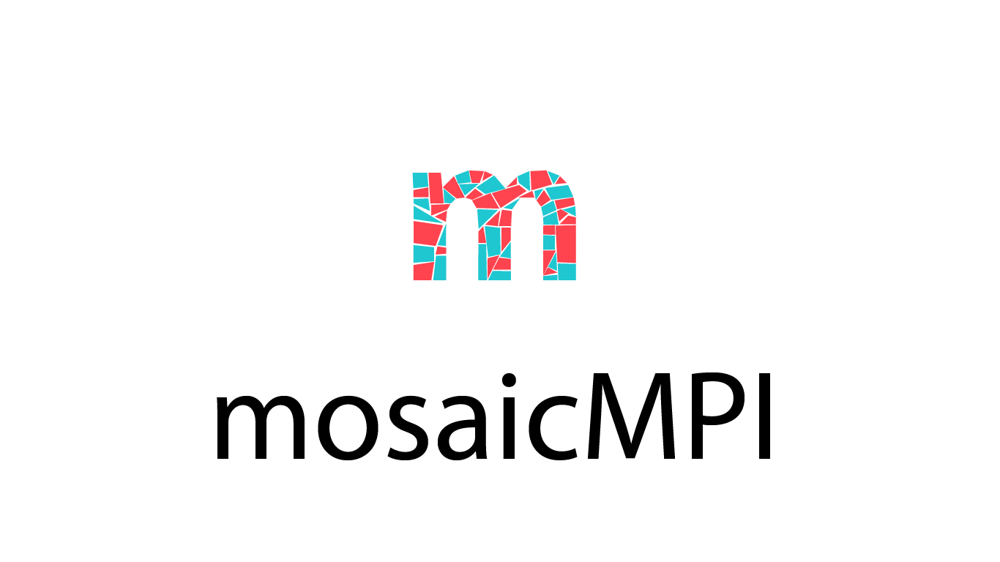

--------------

cNMF-SNS: powerful factorization-based multi-omics integration toolkit
======================================================================

|version badge| |PyPI Latest Release| |Conda Latest Release|
|Documentation status| |Downloads| |License|

Authors: `Ted Verhey <https://github.com/verheytb>`__, `Heewon
Seo <https://github.com/lootpiz>`__, `Sorana
Morrissy <https://github.com/ancasorana>`__

**cNMF-SNS** (consensus Non-negative Matrix Factorization Solution
Network Space) is a Python package enabling integration of bulk,
single-cell, and spatial expression data between and within datasets.
cNMF provides a **robust, unsupervised** deconvolution of each dataset
into gene expression programs (GEPs). **Network-based integration** of
GEPs enables flexible integration of many datasets across assays (eg.
Protein, RNA-Seq, scRNA-Seq, spatial expression) and patient cohorts.

Communities with GEPs from multiple datasets can be annotated with
dataset-specific annotations to facilitate interpretation.

⚡Main Features
---------------

Here are just a few of the things that cNMF-SNS does well:

-  Identifies interpretable, additive non-negative gene expression
   programs
-  Integration of expression data does not require subsetting
   features/genes to a shared or 'overdispersed' subset
-  Ideal for incremental integration (adding datasets one at a time)
   since deconvolution is performed independently on each dataset
   generating invariant GEPs
-  Integration does not require comparable data sparsity or sequencing
   depth (single-cell, bulk)
-  Two interfaces: command-line interface for rapid data exploration and
   python interface for extensibility and flexibility

.. _-install:

🔧 Install
----------

.. _️-public-release:

☁️ Public Release
~~~~~~~~~~~~~~~~~

Install the package with conda:

.. code:: bash

   conda install -c conda-forge cnmfsns

.. _-latest-version-from-github:

✨ Latest version from GitHub
~~~~~~~~~~~~~~~~~~~~~~~~~~~~~

Before installing cNMF-SNS using pip, it is recommended to first set up
a separate conda environment and have conda manage as many dependencies
as possible.

.. code:: bash

   conda create --name cnmfsns -c conda-forge python=3.10 anndata pandas numpy scipy matplotlib upsetplot httplib2 tomli tomli-w click pygraphviz python-igraph semantic_version pyyaml scikit-learn fastcluster scanpy pyyaml
   conda activate cnmfsns
   pip install git+https://github.com/MorrissyLab/cNMF-SNS.git

.. _-documentation:

📖 Documentation
----------------

.. _-python-interface:

📓 Python interface
~~~~~~~~~~~~~~~~~~~

To get started, sample proteomics datasets and a Jupyter notebook
tutorial is available `here </tutorial/tutorial.ipynb>`__.

Detailed API reference can be found on `ReadTheDocs <>`__.

.. _️-command-line-interface:

⌨️ Command line interface
~~~~~~~~~~~~~~~~~~~~~~~~~

See the `command line interface documentation </CLI.md>`__.

.. _-getting-help:

💭 Getting Help
---------------

For errors arising during use of cNMF-SNS, create and browse issues in
the `GitHub "issues"
tab <https://github.com/MorrissyLab/cNMF-SNS/issues>`__.

.. |version badge| image:: https://img.shields.io/badge/version-1.3.0-blue
.. |PyPI Latest Release| image:: https://img.shields.io/pypi/v/cnmfsns.svg
   :target: https://pypi.org/project/cnmfsns/
.. |Conda Latest Release| image:: https://anaconda.org/conda-forge/cnmfsns/badges/version.svg
   :target: https://anaconda.org/anaconda/cnmfsns/
.. |Documentation status| image:: https://readthedocs.org/projects/cnmfsns/badge/?version=latest&style=flat
   :target: 
.. |Downloads| image:: https://static.pepy.tech/personalized-badge/cnmfsns?period=month&units=international_system&left_color=black&right_color=orange&left_text=PyPI%20downloads%20per%20month
   :target: https://pepy.tech/project/cnmfsns
.. |License| image:: https://img.shields.io/pypi/l/cnmfsns.svg
   :target: https://github.com/MorrissyLab/cNMF-SNS/blob/main/LICENSE
